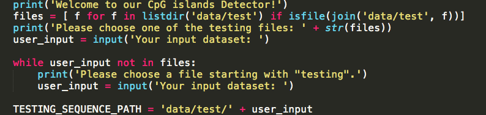
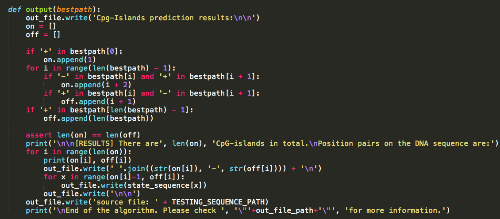
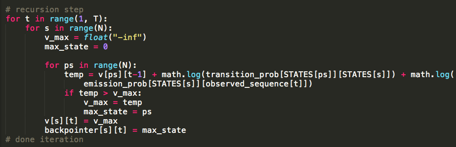

## Report for CpG Island Detector Using HMM and Viterbi Algorithm

#### Team Member and Job Description
Jinghan Lu: implemented the Viterbi Algorithm
Tianyuan Fu: implemented algorithms for probability, finished up the implementation of Viterbi Algorithm

#### Functionality of CpG Island Detector
This program is supposed to identify the potential CpG Islands in a given input DNA sequence. CpG island is defined as a subsequence of a long DNA sequence, which is rich in C and G. According to biological probabilistic researches, DNA regions with high reichness in C and G are more likely to carry gene information. Therefore, this approach to detect CpG Islands can be useful in real-time biological researches.

The input format should be a file describing the composition of a DNA sequence, comprised with A, G, C, T, 4 kinds of nucleotide acids.
The output will be starting and ending position pairs displayed to the console, along with a file containing the whole CpG Island subsequence and more details.

#### Technical Details
For our CpG island detector, we used Hidden Markov Models technique, which allows us to think about causal factors in a probabilistic model with both the observed DNA sequence, which consists of four base pairs of A, G, C, T (known as nucleic acids), and the hidden CpG islands. A HMM consists of a set of N hidden states, which in our case are eight base-sign pairs, where the bases are A, G, C, T and the signs are “+” (belongs to a CpG island) and “-” (does not belong to a CpG island), a transition probability matrix which gives the probability of moving from one state to the another, an observed sequence which is the DNA sequence, a sequence of emission probabilities which represents the probability of observe a base given a hidden state (e.g., P(A|A+) = 1, P(C|G-) = 0…), and an initial probability distribution over the eight hidden states(A+, A-, C+, C-, G+, G-, T+, T-).

In order to determine the most like state sequence given an observed DNA sequence, we implemented a Viterbi algorithm. Viterbi is a kind of dynamic programming, and the idea is to process a observed DNA sequence from left to right by calculating the probability that the HMM is in a certain state after processing all the previous observed AGCTs and output the most possible state sequence for CpG island detections. In our Viterbi, we first initialized a sequence probability matrix and a back pointer matrix to keep track of the states. For each hidden state, we recursively calculated their Viterbi path probabilities by multiplying the previous Viterbi path probability, the transition probability from the previous state to the current one, and the emission probability. Then we chose the maximum Viterbi value to be the most possible state for the that observed nucleic acid and stored the index of the previous state that led to the state with this maximum Viterbi value. At the end of the sequence after the recursion, we picked the state with the highest probability and back trace to get the best state sequence.

In the Viterbi algorithm where we need to calculate probabilities, we used log of the probabilities. The reason is that if we compute probabilities normally, the Viterbi values dropped to zero after a certain point because of the small values of the transition probabilities, which made the comparison hard and led to a wrong result. With the log function, we would be able to compare the values and choose the right state. Additionally, when multiplying emission probabilities in Viterbi, we changed every zero emission probability and transition probability to a small number 10^-30 since log(0) is not defined.

#### Interesting Sample Session
// input/output screenshot:

#### Demo Instructions
1. Unzip the zip file and put the decompressed folder in a directory that you are familiar with
1. Open up a shell window (Linux) / terminal window (macOS) and change the directory into the upzipped folder
1. Check the content of the folder: 
    1. There is a folder called `result/`. This will be where the output files locate
    1. There is a `data/` folder. Inside `data/`, there should be 3 text files and a `test/` folder containing two text files. These are the training and testing data for this program.
1. Back to the console. Try with the command:
`python3 HMM.py`
1. Seeing the prompted message, choose a testing file from the message and type in the console. Hit `enter` to continue.
1. Intermediate results, such as disjoint probability, transition probability would be prinred in the console. 
1. The final results would be in two parts: a message in the console showing the starting and ending position pairs of the CpG Islands; a file in the result folder have whole sequences of islands and some other details.
> You can also add your own DNA sequence files to the `test\` folder and choose it to be executed as the program begins.

#### Code Excerpt
user interaction: allows user to choose the testing file

output: output a file showing the CpG islands and the testing file path

log function: provides more accrate comparison between Viter values

#### What Each Team Member Learned
Tianyuan Fu: HMM is a model that is not formally taught in class, and that is the point of chanllenges and attractiveness. Understanding the model is not the easy thing, involing many concepts from statistics. But during the process of accepting the concepts, I am happy to see that I can apply concepts previously learnt in lectures, most of which are high-level views, and that eased the carryout of the whole project. It would be so helpful to have such an experience since new models of AI and ML are emerging. Having the experience of this project makes me confident to confront projects with more difficulty in the future.

Jinghan Lu: I have learned the Hidden Markov Models which allows us to think about observed and hidden events as causal factors in a probabilistic model and the Viterbi algorithm which allows us to find the most possible state sequence given an HMM and an observed sequence. Additionally, I have learned how HMM can be also applied to many different applications, such as sequence recognition and speech recogition.

#### Possible Add-ons
- Input side: support to more biological data format like FASTA.
- Processing side: the current method for calculating the probability can be improved to have less complexity
- Output side: a graphical user interface (GUI) can be implemented to display the results.

#### *References*
1. GitHub Repository: https://github.com/devanshdalal/cpg-island-prediction-HMM
A smaple implementation of CpG Island Detector with HMM and Viterbi Algorithm. We have our training data set from this project, but different concepts of implementing the program.
2. HMM slides from CMU: https://www.cs.cmu.edu/~02710/Lectures/HMMs.pdf
Provided some hint and insights to HMM.
3. National Center for Biotechnology Information: https://www.ncbi.nlm.nih.gov/genome/gdv/browser/
NCBI provides us a dataset of human DNA, Chromesome 1, which we used the first 1110 lines of this dataset as one of the testing file.
4. HMM Chapter from Standford: https://web.stanford.edu/~jurafsky/slp3/A.pdf
We used this chapter of HMM as a tutorial for learning HMM and implmenting Viterbi algorithm. 

For 5 points of extra credit, include a section with a heading "Partners' Reflections" with two subsections, one for each partner. Each subsection should give the partner's name, main role(s) in the project, a description of the challenges and benefits of the partnership from that partner's perspective.
